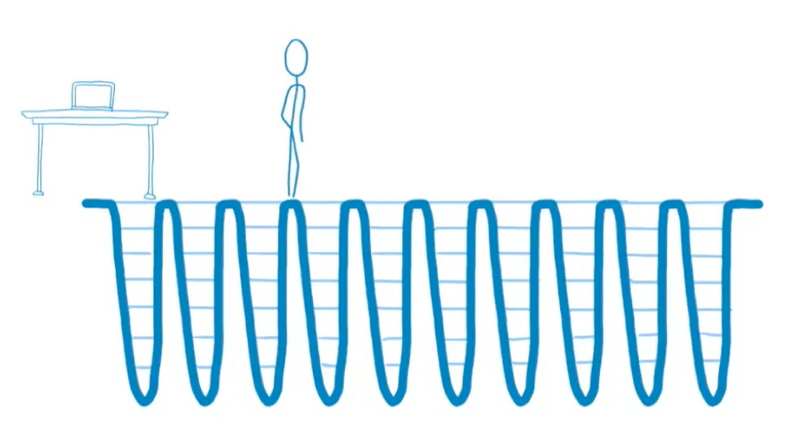
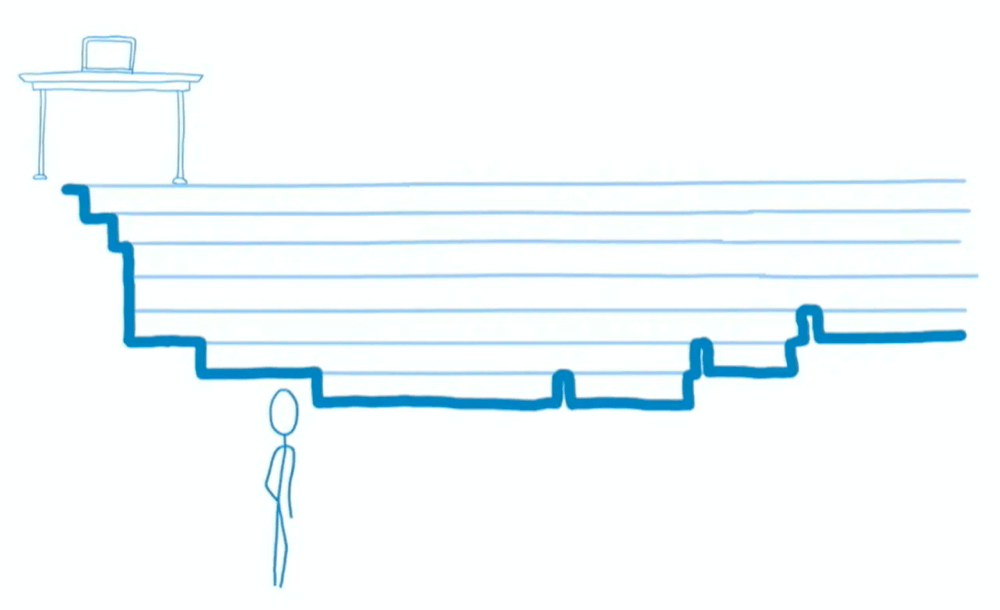
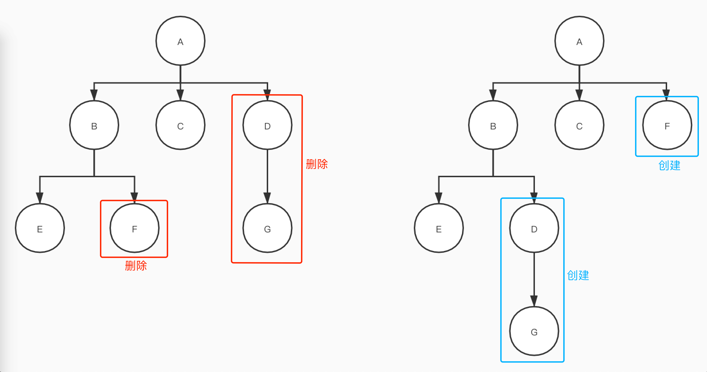
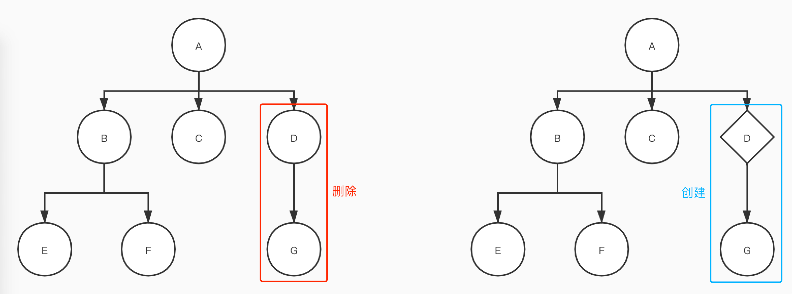
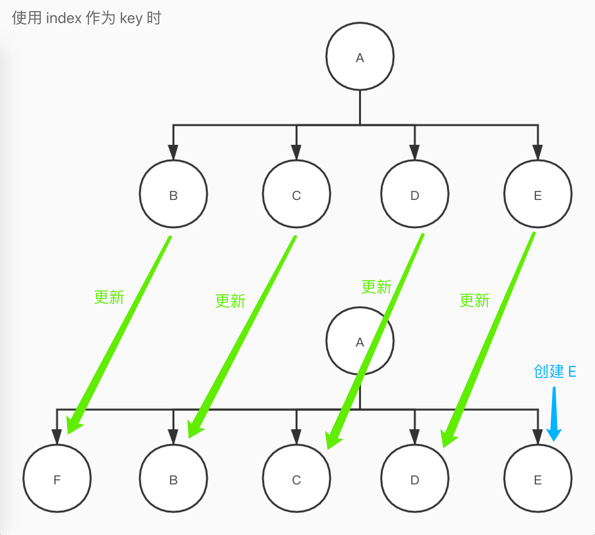
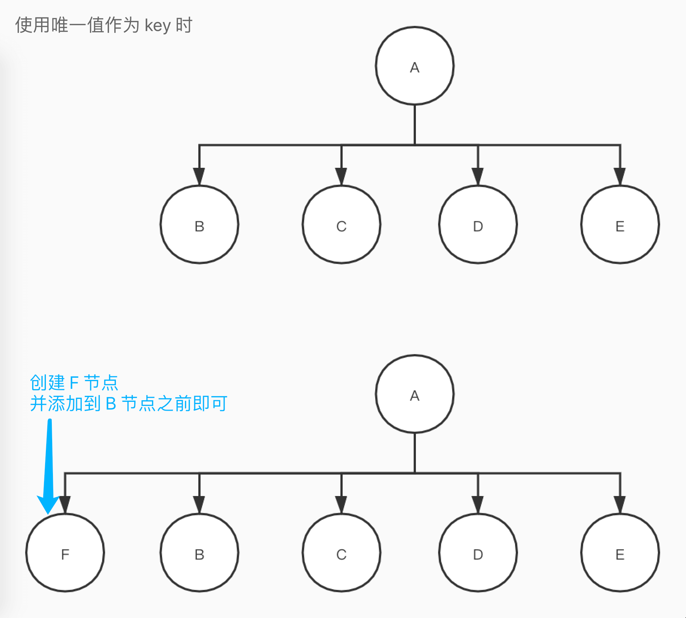
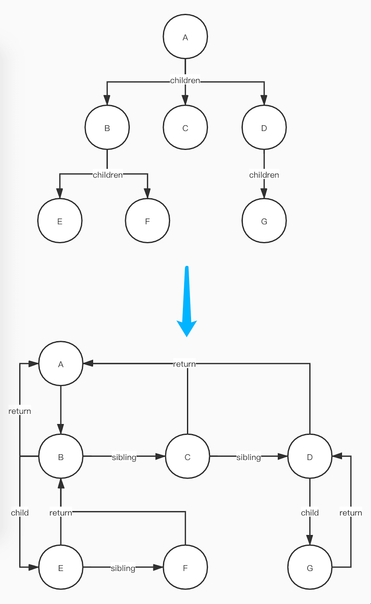

# React Fiber 简单实现

## 前言

### 渲染过程

`fiber` 渲染过程



之前的树形结构渲染过程：



### `diff` 策略

- 同级比较，Web UI 中 DOM 节点跨层级的移动操作特别少，可以忽略不计。如出现跨层级的移动操做，则直接将原 DOM 树删除，重新创建

> 所以下图的 D 节点所在 DOM 树会被删除重新创建，F 节点也会被删除后，重新创建



- 拥有不同类型的两个组件将会生成不同的树形结构。不同类型的两个组件则认为是删除原 DOM 树之后重新创建

> 下图的 D 节点所在 DOM 树会被删除后重新创建



- 开发者可以通过 `key prop` 来暗示哪些子元素在不同的渲染下能保持稳定

  - 不使用 `key` 或使用 `index` 作为 `key` 时，下图会进行 F、B、C、D 节点的更新，并新增 E 节点

  

  - 使用唯一 `key` 值时，只会新增 F 节点添加到 B 节点之前，B、C、D、E 节点都不会发生更新操作
  
  

## `fiber` 思想

将树形结构转化成链表结构



### `Fiber` 对象

`fiber` 是一个链表元素对象，包含以下基本属性

- type：节点类型
- key：节点 key
- props：节点属性
- child：第一个子 `fiber`
- node：对应的真实 `DOM`
- base：对应的上一次的 `fiber`
- return：父 fiber
- sibling：下一个兄弟 `fiber`

有了这些属性就可以构成一个链表结构，可以通过当前 `fiber` 找到父 `fiber` 以及兄弟 `fiber`

### `requestIdleCallback`

- `api: window.requestIdleCallback(callback)`
- 作用
  - 当浏览器处于空闲状态时，会调用传入的 callback 函数
  - callback 会接受一个参数 deadLine
  - 可以通过 deadLine.timeRemaining 判断浏览器是否处于空闲状态
- [参考地址](https://developer.mozilla.org/en-US/docs/Web/API/Window/requestIdleCallback)

## 一、初始化

### 执行 `fiber`

定义 `perforUnitOfWork` 函数用来对 `fiber` 进行操作和更新

`perforUnitOfWork` 有两个作用

- 执行 `fiber` 任务
- 返回下一个需要执行的 `fiber` 任务

```js
function perforUnitOfWork(fiber) {
  if (!fiber) {
    return null;
  }
  // 1、执行 fiber 操作
  const { type } = fiber;
  if (typeof type === "function") {
    type.prototype && type.prototype.isReactComponent
      ? updateClassComponent(fiber)
      : updateFunctionComponent(fiber);
  } else {
    updateHostComponent(fiber);
  }

  /**
   * 2、返回下一个 fiber
   *  优先返回子节点 fiber
   *  如果没有子 fiber，返回兄弟节点 fiber
   *  没有兄弟节点 fiber，返回父节点的 fiber
   */
  if (fiber.child) {
    return fiber.child;
  }

  while (fiber) {
    if (fiber.sibling) {
      return fiber.sibling;
    }
    fiber = fiber.return;
  }
  return null;
}
```

`updateHostComponent function` 更新原始 DOM 标签

- 为 `fiber` 设置 `node` 属性
- 协调子元素，生成链表结构

```js
function updateHostComponent(fiber) {
  if (!fiber.node) {
    fiber.node = createNode(fiber);
  }
  if (fiber.props && fiber.props.children) {
    reconcileChildren(fiber, fiber.props.children);
  }
}
```

`updateClassComponent function` 更新类组件

- 将类组件创建后执行 `render`
- 将 `render` 产生的虚拟 DOM 和类组件的 `fiber` 生成链表结构

```js
function updateClassComponent(fiber) {
  const { type: Type, props } = fiber;
  const vNode = new Type(props).render();
  reconcileChildren(fiber, [vNode]);
}
```

`updateFunctionComponent function` 更新函数式组件

- 执行函数组件
- 将函数组件返回的虚拟 DOM 和 函数组件的 `fiber` 生成链表结构

```js
function updateFunctionComponent(fiber) {
  const { type, props } = fiber;
  const vNode = type(props);
  reconcileChildren(fiber, [vNode]);
}
```

### 创建真实 DOM

`createNode` 创建真实 DOM

```js
function createNode(fiber) {
  let node = null;
  const { type, props } = fiber;
  if (type === "TEXT") {
    node = document.createTextNode("");
  } else if (typeof type === "string") {
    node = document.createElement(type);
  } else {
    node = document.createDocumentFragment();
  }

  updateNode(node, props);

  return node;
}
```

`updateNode` 更新 DOM 属性

```js
function updateNode(node, nextProps) {
  if (!nextProps) {
    return;
  }
  Object.keys(nextProps)
    .filter(propName => propName !== "children")
    .forEach(propName => {
      // 设置事件监听
      if (propName.startsWith("on")) {
        const eventName = propName.slice(2).toLowerCase();
        node.addEventListener(eventName, nextProps[propName]);
      } else {
        // 设置节点属性
        node[propName] = nextProps[propName];
      }
    });
}
```

### 协调子元素，生成链表结构

`reconcileChildren` 协调子元素

```js
function reconcileChildren(returnFiber, children) {
  let prevFiber = null;

  // 循环子元素，生成链表结构
  for (let i = 0; i < children.length; i++) {
    const child = children[i];

    const newFiber = {
      type: child.type,
      key: child.key,
      props: child.props,
      node: null,
      base: null,
      return: returnFiber,
      effectTag: "PLACEMENT"
    };
    if (prevFiber === null) {
      returnFiber.child = newFiber;
    } else {
      prevFiber.sibling = newFiber;
    }
    prevFiber = newFiber;
  }
}
```

> 上面只是写了执行 fiber 任务的 perforUnitOfWork 函数，但是还没有调用过，下面我们看看 perforUnitOfWork 函数是什么时候被调用的

### `workLoop`

作用：轮询判断是否需要执行 `fiber` 操作。

通过 `requestIdleCallback` 方法判断，在浏览器处于空闲状态时才会继续执行 `perforUnitOfWork` 函数

```js
// 下一个将被执行的 fiber
let nextUnitWork = null;
// `root fiber`
let wipRoot = null;

function workLoop(deadLine) {
  while (nextUnitWork && deadLine.timeRemaining() > 0) {
    nextUnitWork = perforUnitOfWork(nextUnitWork);
  }

  if (nextUnitWork == null && wipRoot) {
    commitRoot();
  }

  window.requestIdleCallback(workLoop);
}

window.requestIdleCallback(workLoop);
```

### 提交更新

`commitRoot`：提交 `root fiber` 任务

```js
function commitRoot() {
  commitWorker(wipRoot.child);
  wipRoot = null;
}
```

`commitWorker`：更新 `fiber` 节点

```js
function commitWorker(fiber) {
  if (!fiber) {
    return;
  }

  if (fiber.node && fiber.effectTag === "PLACEMENT") {
    let parentFiber = fiber.return;
    let parentNode = null;
    while (parentFiber) {
      if (parentFiber.node && parentFiber.node.nodeType !== 11) {
        parentNode = parentFiber.node;
        break;
      }
      parentFiber = parentFiber.return;
    }
    parentNode.appendChild(fiber.node);
  }

  // 提交子 fiber 任务
  commitWorker(fiber.child);
  // 提交兄弟 fiber 任务
  commitWorker(fiber.sibling);
}
```

### `render` 渲染函数

> workLoop 函数中，执行 perforUnitOfWork 方法的条件是 nextUnitWork 存在。
> 因此我们需要给 nextUnitWork 一个初始值，我们在界面上调用 render 函数的时候可以给 nextUnitWork 和 wipRoot 赋上初始值

`render`

```js
const render = (vNode, container) => {
  wipRoot = {
    props: {
      children: [vNode]
    },
    node: container,
    base: null,
    return: null,
    sibling: null
  };

  nextUnitWork = wipRoot;
};
```

## 二、`useState`

> 更新的话:
>
> 1、需要重新启动 `fiber` 任务，所以这里我们新增一个 **`currentRootFiber`** 用来存储上一次的 `wipRoot`；
>
> 2、需要知道当前执行的 `fiber` 是哪个，所以需要新增一个 **`wipFunctionFible`** 变量在 `updateFunctionComponent` 的时候赋值
>
> 3、不同类型的元素进行切换时，需要删除之前的元素节点，因此需要新增一个 **`deletions`** 变量用来存储需要删除的 `fiber`

```js
let currentRootFiber = null;

let wipFunctionFible = null;

let deletions = [];
```

### 更新函数 `useState`

- 初始化阶段：直接返回初始值和 setState 函数

- 更新阶段：从上一次的 fiber 中取出之前的 `hook` 值，为 `state` 赋上最新的值

- `setState` 函数会给将新的 `state` 值填充到 `hook` 的 `queue` 属性中

- 函数组件每次更新会重新执行 `useState`
  - 会从 `hook` 的 `queue` 属性中取出最新的 `state` 值
  - 并将 `hookIndex` 后移，执行下一个 `hook`

```js
/**
 * 函数组件更新 state 的 hook
 * @param {*} init
 */
export const useState = init => {
  /**
   * 获取到上一次的 fiber ，如果存在，则取出上一次的 fiber 中存储的 hooks
   * 根据当前执行 fiber 的 hookIndex 找到当前 useState 值的 oldHook
   * 如果 oldHook 存在，则使用 oldHook，不存在则使用初始值
   *
   * 循环 hook 中队列 queue 存储的值，为 state 设置最新的值
   */
  const oldFiber = wipFunctionFible.base && wipFunctionFible.base;
  const oldHook = oldFiber && oldFiber.hooks[wipFunctionFible.hookIndex];
  const hook = oldHook
    ? { state: oldHook.state, queue: oldHook.queue }
    : { state: init, queue: [] };
  hook.queue.forEach(i => (hook.state = i));
  hook.queue = [];

  /**
   * 设置 state，将接收到的 aciton push 到队列 queue 中
   *
   * 为 wipRoot 赋值，并将 wipRoot 赋值给 nextUnitWork，启动 fiber 任务
   */
  const setState = action => {
    // 若新的 action 和 上一次的 state 相同，则无需更新
    if (action === hook.state) {
      return;
    }
    // 不同，则 push 到 queue 中
    hook.queue.push(action);
    wipRoot = {
      props: currentRootFiber.props,
      node: currentRootFiber.node,
      base: currentRootFiber
    };
    nextUnitWork = wipRoot;
    deletions = [];
  };

  /**
   * 将 hook push 到 wipFunctionFible 的 hooks 属性中，用于下一次的更新操作。
   * 并将 wipFunctionFible 的 hookIndex 后移，执行下一个 useState
   */
  wipFunctionFible.hooks.push(hook);
  wipFunctionFible.hookIndex++;

  return [hook.state, setState];
};
```

### 修改 `updateFunctionComponent` 函数

在 `updateFunctionComponent` 中为 fiber 设置 `hooks` 和 `hookIndex` 属性，用来在后面操作 `useState` 时使用

- `hooks` 属性：保存函数组件中的 `hook`

- `hookIndex` 属性：当前函数组件中执行到某个 `hook` 的下标

```js
function updateFunctionComponent(fiber) {
    fiber.hooks = [];
    fiber.hookIndex = 0;
    wipFunctionFible = fiber;

    const { type, props } = fiber;
    const vNode = type(props);
    reconcileChildren(fiber, [vNode]);
}
```

### 修改 `reconcileChildren` 函数

```js
function reconcileChildren(returnFiber, children) {
  let prevFiber = null;

  let oldFiber = returnFiber.base && returnFiber.base.child;
  // 循环子元素，生成链表结构
  for (let i = 0; i < children.length; i++) {
    const child = children[i];
    let newFiber = null;

    // 判断 oldFiber 和 child 是否可以复用
    const sameType =
      oldFiber &&
      child &&
      oldFiber.key === child.key &&
      oldFiber.type === child.type;

    // 1、如果可以复用，则将 oldFiber 设置为 newFiber 的 base 属性，并将 effectTag 设置为 UPDATE
    if (sameType) {
      newFiber = {
        type: child.type,
        key: child.key,
        props: child.props,
        node: oldFiber.node,
        base: oldFiber,
        return: returnFiber,
        effectTag: "UPDATE"
      };
    }

    // 2、如果不能复用，则将 newFiber 的 effectTag 属性设置为 PLACEMENT
    if (!sameType && child) {
      newFiber = {
        type: child.type,
        key: child.key,
        props: child.props,
        node: null,
        base: null,
        return: returnFiber,
        effectTag: "PLACEMENT"
      };
    }

    // 3、如果 oldFiber 存在但是不能复用，则将 oldFiber 的 effectTag 属性设置为 DELETION，
    //  并添加到 deletions 数组中
    if (oldFiber && !sameType) {
      oldFiber.effectTag = "DELETION";
      deletions.push(oldFiber);
    }

    // oldFiber 后移，找到兄弟节点
    if (oldFiber) {
      oldFiber = oldFiber.sibling;
    }

    if (prevFiber === null) {
      returnFiber.child = newFiber;
    } else {
      prevFiber.sibling = newFiber;
    }
    prevFiber = newFiber;
  }
}
```

### 在 `commitWorker` 函数中新增更新和删除操作

- 判断 `effectTag` 为 `PLACEMENT`，执行新增操作

- 判断 `effectTag` 为 `UPDATE`，则进行属性更新

- 判断 `effectTag` 为 `DELETION`，则将上一次的 `fiber` 的 `node` 节点，从文档中删除

```js
function commitWorker(fiber) {
  if (!fiber) {
    return;
  }

  // 执行新增插入操作
  if (fiber.node && fiber.effectTag === "PLACEMENT") {
    let parentFiber = fiber.return;
    let parentNode = null;
    // 有可能 parentFiber 是fragment 或者 Provider 等这些组件，是没有 node 属性的，所以要循环向上找到 parentNode
    while (parentFiber) {
      if (parentFiber.node && parentFiber.node.nodeType !== 11) {
        parentNode = parentFiber.node;
        break;
      }
      parentFiber = parentFiber.return;
    }
    parentNode.appendChild(fiber.node);
  } else if (fiber.node && fiber.effectTag === "UPDATE") {
    // 执行属性更新操作
    updateNode(fiber.node, fiber.base.props, fiber.props);
  } else if (fiber.effectTag === "DELETION") {
    // 执行删除操作
    commitDeletion(fiber);
    // !!! 这里要 return 掉，不能执行 child 和 sibling，因为 child 和 sibling 的 effectTag 值并没有修改成 DELETION
    return;
  }

  // 提交子 fiber 任务
  commitWorker(fiber.child);
  // 提交兄弟 fiber 任务
  commitWorker(fiber.sibling);
}
```

### 删除操作 `commitDeletion`

```js
function commitDeletion(fiber) {
  // 当前 fiber 上不存在 node，则删除子 fiber 的 node
  if (fiber.node) {
    fiber.node.remove();
  } else {
    commitDeletion(fiber.child);
  }
}
```

### 修改更新函数

对比新旧属性，删除旧属性，设置新属性。

```js
function updateNode(node, prevProps, nextProps) {
  if (!node || !nextProps || !prevProps) {
    return;
  }

  /**
   * 移除上一次的事件监听
   * 若当前 nextProps 中不包含上一次的某个属性，则将该属性值置为空
   */
  Object.keys(prevProps)
    .filter(propName => propName !== "children")
    .forEach(propName => {
      if (propName.startsWith("on")) {
        const eventName = propName.slice(2).toLowerCase();
        node.removeEventListener(eventName, prevProps[propName], false);
      } else if (!([propName] in nextProps)) {
        node[propName] = "";
      }
    });

  // 将新的属性设置到 node 上
  Object.keys(nextProps)
    .filter(propName => propName !== "children")
    .forEach(propName => {
      // 设置事件监听
      if (propName.startsWith("on")) {
        const eventName = propName.slice(2).toLowerCase();
        node.addEventListener(eventName, nextProps[propName], false);
      } else {
        // 设置节点属性
        node[propName] = nextProps[propName];
      }
    });
}
```

> 但是此时组件只能进行插入和更新，还不能进行复用，也不能计算出新的组件应该插入的位置。所以我们需要改写一下 `reconcileChildren` 函数

## 三、更新过程

就是新旧组件的 `diff` 过程，遵循上面提到的 `react diff` 思想。

### 定义变量

```js
function reconcileChildren(returnFiber, children) {
  // 找到上一次的 fiber
  let oldFiber = returnFiber.base && returnFiber.base.child;

  let prevFiber = null;

  // fiber 上一次的位置下标
  let lastPlacedIndex = 0;

  // 用来循环的下标
  let newIdx = 0;

  // 用来临时存放 oldFiber 的变量
  let nextOldFiber = null;

  // 判断初次渲染还是更新的 flag
  const shouldTrackSideEffects = !!oldFiber;
}
```

### 记录组件对应的 index 值

`placeChild` 函数

``` js
function placeChild(newFiber, lastPlacedIndex, newIdx, shouldTrackSideEffects) {
    // 将 newFiber 在当前层级的位置设置到 newFiber 的 index 属性上
    newFiber.index = newIdx;
    if (!shouldTrackSideEffects) {
        return lastPlacedIndex;
    }
    const base = newFiber.base;
    if (base !== null) {
        if (base.index < lastPlacedIndex) {
            return lastPlacedIndex;
        } else {
            return base.index;
        }
    } else {
        newFiber.effectTag = PLACEMENT;
        return lastPlacedIndex;
    }
}
```

### 组件更新时

```js
/ 1、组件更新时，走这个条件分支
for (; oldFiber && newIdx < children.length; newIdx++) {
  const newChild = children[newIdx];
  if (oldFiber.index > newIdx) {
    nextOldFiber = oldFiber;
    oldFiber = null;
  } else {
    nextOldFiber = oldFiber.sibling;
  }

  if (oldFiber === null) {
    oldFiber = nextOldFiber;
  }

  const sameType =
        newChild &&
        oldFiber &&
        newChild.key === oldFiber.key &&
        newChild.type === oldFiber.type;

  if (!sameType) {
    break;
  }

  const newFiber = {
    type: newChild.type,
    key: newChild.key,
    props: newChild.props,
    return: returnFiber,
    node: oldFiber.node,
    base: oldFiber,
    effectTag: UPDATE,
  };

  lastPlacedIndex = placeChild(newFiber, lastPlacedIndex, newIdx, shouldTrackSideEffects);

  if (prevFiber === null) {
    returnFiber.child = newFiber;
  } else {
    prevFiber.sibling = newFiber;
  }
  prevFiber = newFiber;

  oldFiber = nextOldFiber;
}
```

### 新组件循环完毕时

```js
// 2、如果是循环结束，会走到这个条件分支，则将剩余的 oldFiber 删除
if (newIdx === children.length) {
  while (oldFiber) {
    deletions.push({
      ...oldFiber,
      effectTag: DELETION
    });
    oldFiber = oldFiber.sibling;
  }
}
```

### 初始化或者新增时

```js
// 3、如果 oldFiber 不存在，代表新增元素，可能是初始化，也可能是新插入的元素
if (!oldFiber) {
  for (; newIdx < children.length; newIdx++) {
    const newChild = children[newIdx];
    if (!newChild) {
      continue;
    }
    const newFiber = {
      type: newChild.type,
      key: newChild.key,
      props: newChild.props,
      return: returnFiber,
      node: null,
      base: null,
      effectTag: PLACEMENT
    };
    lastPlacedIndex = placeChild(
      newFiber,
      lastPlacedIndex,
      newIdx,
      shouldTrackSideEffects
    );

    if (prevFiber === null) {
      returnFiber.child = newFiber;
    } else {
      prevFiber.sibling = newFiber;
    }
    prevFiber = newFiber;
  }
  return;
}
```

### 新旧组件 `index` 不同但可以复用时

```js
// 将链表结构转化成 map 结构
const existingChildren = mapRemainingChildren(returnFiber, oldFiber);
// 4、当 oldFiber 存在并且 oldFiber 不能被复用的时候，会走到这个条件分支
for (; newIdx < children.length; newIdx++) {
  const newChild = children[newIdx];
  let newFiber = {
    type: newChild.type,
    key: newChild.key,
    props: newChild.props,
    return: returnFiber
  };

  /**
   * 和第 1 个条件分支不同：
   *  1 中是一一对比，看是否能够复用 oldFiber
   *  这里是根据 key(没有 key 使用 index) 从剩余的 oldFiber 中查找出是否有对应的 oldFiber
   */

  const matchedFiber = existingChildren.get(
    newChild.key == null ? newIdx : newChild.key
  );

  // 如果匹配到对应 key / index 的 oldFiber，并且 type 也是相同的，则可以进行复用，更新即可
  if (matchedFiber && matchedFiber.type === newChild.type) {
    newFiber = {
      ...newFiber,
      node: matchedFiber.node,
      base: matchedFiber,
      effectTag: UPDATE
    };
    // 匹配到 oldFiber 之后，则从 map 中移除对应的 fiber，避免重复匹配
    existingChildren.delete(newChild.key == null ? newIdx : newChild.key);
  } else {
    // 没有匹配到的话，则新增 fiber
    newFiber = {
      ...newFiber,
      node: null,
      base: null,
      effectTag: PLACEMENT
    };
  }
  lastPlacedIndex = placeChild(
    newFiber,
    lastPlacedIndex,
    newIdx,
    shouldTrackSideEffects
  );
  if (prevFiber === null) {
    returnFiber.child = newFiber;
  } else {
    prevFiber.sibling = newFiber;
  }
  prevFiber = newFiber;
}

// 更新阶段，fiber 操作执行完毕，map 中仍有未被匹配的 oldFiber ，则进行删除
if (shouldTrackSideEffects) {
  existingChildren.forEach(child => {
    deletions.push({
      ...child,
      effectTag: DELETION
    });
  });
}
```

将链表转化为 `Map` 结构的 `mapRemainingChildren` 函数

> 查询是否有可复用 oldFiber 时，从 Map 中查找比链表要更方便，所以可以提前将链表结构转为 Map

```js
function mapRemainingChildren(returnFiber, currentChildFiber) {
  const existingChildren = new Map();
  while (currentChildFiber) {
    if (currentChildFiber.key !== null) {
      existingChildren.set(currentChildFiber.key, currentChildFiber);
    } else {
      existingChildren.set(currentChildFiber.index, currentChildFiber);
    }
    currentChildFiber = currentChildFiber.sibling;
  }
  return existingChildren;
}
```

### 修改 `DOM` 新增的方式

修改 `commitWorker` 函数

```js
function commitWorker(fiber) {
  if (!fiber) {
    return;
  }

  // 执行新增插入操作
  if (fiber.node && fiber.effectTag === PLACEMENT) {
    let parentFiber = fiber.return;
    let parentNode = null;
    // 有可能 parentFiber 是 Fragment 或者 Provider 等这些组件，是没有 node 属性的，所以要循环向上找到 parentNode
    while (parentFiber) {
      if (parentFiber.node && parentFiber.node.nodeType !== FRAGMENT) {
        parentNode = parentFiber.node;
        break;
      }
      parentFiber = parentFiber.return;
    }
    if (fiber.type !== "TEXT") {
      console.log("新增", fiber);
    }
    // parentNode.appendChild(fiber.node);
    insertOrAppend(fiber, parentNode);
  } else if (fiber.node && fiber.effectTag === UPDATE) {
    // 执行属性更新操作
    updateNode(fiber.node, fiber.base.props, fiber.props);
  } else if (fiber.effectTag === DELETION) {
    // 执行删除操作
    commitDeletion(fiber);
    // !!! 这里要 return 掉，不能执行 child 和 sibling，因为 child 和 sibling 的 effectTag 值并没有修改成 DELETION
    return;
  }

  // 提交子 fiber 任务
  commitWorker(fiber.child);
  // 提交兄弟 fiber 任务
  commitWorker(fiber.sibling);
}
```

`insertOrAppend` 函数

```js
function getHostSibling(fiber) {
  let sibling = fiber.return.child;
  while (sibling) {
    // !!! 这里判断 fiber.index 小于它的兄弟节点 index 即可，因为此时 index 可能不是连续的，不能直接使用 fiber.index + 1 === sibling.index 来判断
    if (fiber.index < sibling.index && sibling.effectTag === "UPDATE") {
      return sibling.node;
    }
    sibling = sibling.sibling;
  }

  return null;
}

function insertOrAppend(fiber, parentNode) {
  let before = getHostSibling(fiber);
  let node = fiber.node;
  if (before) {
    parentNode.insertBefore(node, before);
  } else {
    parentNode.appendChild(node);
  }
}
```

> 至此，`fiber` 的初始化和更新操作已经基本完成。这里只是简单的对 `fiber` 思想进行了一个实现，还有很多功能没有完善。比如重新排序的组件还不能按照正确的顺序执行。有兴趣的朋友可以继续向下拓展。
